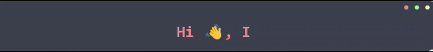

</img>

<h1 align="center" style="color: rgb(241, 148, 148)"> About Me</h1>

I love learning other programming languages, focused on backend development but I have no problem with frontend development.

- 🔭 I’m currently studying on **[SoyHenry](https://www.soyhenry.com/)**

- 🌱 I’m currently learning **Javascript,React,Redux,Laravel**

- 💬 Ask me about **Javascript, php, css, Laravel**

- 📫 How to reach me **wilmerandressotoalmeida@gmail.com**

<h2 align="left">Languages and Tools:</h2>

<table style="border: 1px solid rgb(241, 148, 148); border-radius: 2rem; text-align: center">
    <thead>
        <tr>
            <th style="text-align: center" colspan="4">Front-end</th>
        </tr>
    </thead>
    <tbody>
        <tr>
            <td></td>
            <td></td>
            <td></td>
            <td></td>
        </tr>
        <tr>
            <td colspan="2">

</td>
            <td colspan="2">

</td>
        </tr>
    </tbody>
</table>
 
<table style="border: 1px solid rgb(241, 148, 148); border-radius: 2rem; text-align: center">
    <thead>
        <tr>
            <th style="text-align: center" colspan="5">Back-end</th>
        </tr>
    </thead>
    <tbody>
        <tr>
            <td></td>
            <td></td>
            <td></td>
            <td></td>
        </tr>
        <tr>
            <td colspan="4">

</td>
        </tr>
        <tr>
            <td></td>
            <td></td>
            <td></td>
            <td></td>
        </tr>
    </tbody>
</table>
 
<table style="border: 1px solid rgb(241, 148, 148); border-radius: 2rem; text-align: center">
    <thead>
        <tr>
            <th style="text-align: center" colspan="5">Others</th>
        </tr>
    </thead>
    <tbody>
        <tr>
            <td></td>
            <td></td>
            <td></td>
            <td></td>
        </tr>
    </tbody>
</table>
 
